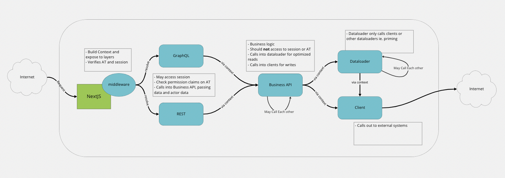

# NextJS Clean Architecture

This is a [Next.js](https://nextjs.org/) project bootstrapped with
[`create-next-app`](https://github.com/vercel/next.js/tree/canary/packages/create-next-app).

This stack employs the tenants of Clean Architecture, using
[`hyper`](https://hyper.io) as general purpose services tier
and [`graphql`](https://graphql.org/) to expose a presentation model.

<!-- toc -->

- [Getting Started](#getting-started)
- [Architecture](#architecture)
  - [Stack](#stack)
  - [Data Flow](#data-flow)
    - [A Note on Context](#a-note-on-context)
    - [GraphQL](#graphql)
- [Relevant Code](#relevant-code)
  - [Business Logic and Entities](#business-logic-and-entities)
- [Testing](#testing)
  - [Unit Tests](#unit-tests)
  - [Contract Tests](#contract-tests)
- [Domains](#domains)

<!-- tocstop -->

## Getting Started

> If you're using Gitpod, all of this is done for you

You will need to enable [corepack](https://nodejs.org/api/corepack.html) by running `corepack enable`,
so that `yarn berry` can be used. Then run `yarn set version berry`.

> `yarn berry` supports using `node_modules`, and is completely backwards compatible with `yarn 1.x`

Run `yarn` to install dependencies

You'll need to create a `.env` file. You can generate one with default values by
running `node env.cjs`.

```text
HYPER=...
```

Then:

```
yarn dev
```

This will start:

- [NextJS](https://nextjs.org/) on
  [http://localhost:3000](http://localhost:3000)
- [`hyper-nano`](https://blog.hyper.io/introducing-hyper-nano-hyper-cloud-in-a-bottle/)
  will be downloaded, started on port `6363`, and a `data` and `cache` service bootstrapped

There is a `graphql` at `/api/graphql` equipped with the [`GraphiQL Playground`](https://github.com/graphql/graphiql)

There is also a serveless function endpoint at `/api/hello`

These both demonstrate how dependencies may be injected, so that even endpoints and graphql resolvers can be easily unit tested.

## Architecture

### Stack

Frontend:

- React/[NextJS](https://nextjs.org/)
- [TailwindCSS](https://tailwindcss.com/)

Backend:

- [NextJS](https://nextjs.org/)
- [GraphQL](https://graphql.org) ([`graphql-helix`](https://github.com/contra/graphql-helix))

Tooling/Utility:

- Zod (for schema parsing and validation)
- hyper-connect (hyper SDK)
- ramda
- prettier, typescript, eslint, husky, lint-staged (code style,linting)

This application uses [hyper](https://hyper.io) as a services tier, using the [data](https://hyper.io/product#data) and [cache](https://hyper.io/product#cache) services.

Both the business (or entity) models and document models are simple [`zod`](https://github.com/colinhacks/zod) schemas. It's important to keep the persistence model and your business model decoupled, so that each is able to diverge from each other. This helps ensure the persistence layer remains an implementation detail.

The presentation tier uses [GraphQL](https://graphql.org) to power the presentation model. Again, it's important to keep the presentation model and the business model decoupled, so that each is able to diverge from each other.

### Data Flow



The structure of this project follows the tenants of Clean Architecture.

The way data flows through this application is very purposefully consistent, as it encourages business logic encapsulation, efficient data fetching, and clear separation of concerns.

Data in the backend typically flows through these layers:

```text
GraphQL -> Business API -> dataloader|client (effects)
# OR
REST -> Business API -> dataloader|client (effects)
```

Data flows into the backend either via REST endpoints, or GraphQL. Almost all communication from the frontend ought to be done via GraphQL, but REST can also be used. For example, file upload is notoriously "weird" using GraphQL, so using a regular HTTP endpoint, that still calls into business services, may be preferred.

> **The frontend should almost always use GraphQL to communicated with the backend**

#### A Note on Context

Every request, GraphQL or REST or `getServerSideProps`, flows through the `middleware` composed onto `getServerSideProps` and endpoints in `/pages/api`. The `middlewares` are located in `/lib/middleware`.

The `middleware` is where an application `context` is built out, and attached to the Request. This `context`, which is unique per request, is where all downstream execution will derive their application dependencies. You can think of Context as an IoC container of the instantiated dependencies. Each layer in the backend will use `context` to access subsequent layers.

> As a general rule of thumb, `context` is where each layer finds its dependencies. It is strongly typed, so you shouldn't have issues finding what you need. If you're trying to import a dependency, it better be a `model` from `/lib/domain/models` or a utility installed via `npm` ie. `ramda`. Application deps ie. `apis`, `dataloaders`, `clients`, `config`, should all be accessed via `context`, in any layer.

#### GraphQL

The `/lib/graphql` folder has the following structure:

```text
├── mutation.schema.ts
├── query.schema.ts
├── [type].schema.ts
├── resolvers.ts <-- resolver utilities ie. reusuable pieces
├── schema.ts <-- all "mini-schemas" are combined
```

Each GraphQL type "mini-schema" exports `typeDefs`, `resolvers` and `transformers` at the top level. `transformers` are primarily for `directives` to weave additional functionality into the Graph.

Each GraphQL resolver receives any application level dependencies via the `context` argument (the third argument passed to every resolver). To obtain data, **GraphQL resolvers should almost always call into `apis`**. A resolver should **never** call into `dataloaders` or `clients`.

## Relevant Code

### Business Logic and Entities

All business logic and entities can be found in [./lib/domain](./lib/domain/)

In particular [./lib/domain/models](./lib/domain/models) contains all our entities and business rules. All of this logic has no dependencies other than utilities ie. `ramda`, `zod`, etc. and each other, and therefore is very easy to unit test!

[./lib/domain/apis](./lib/domain/apis) weaves side effects, received via simple dependency injection, with our business rules.

> Read more on business logic encapsulation and Clean Architecture
> [here](https://blog.hyper.io/clean-architecture-at-hyper/)

You can access business services in an
[API Route Handler](https://nextjs.org/docs/api-routes/introduction) by wrapping
the handler with the [`withMiddleware`](./lib/middleware/index.ts)
middleware. This will add the `DomainContexrt` on the `NextApiRequest` at
`req.domain`.

You can access business services in
[`getServerSideProps`](https://nextjs.org/docs/basic-features/data-fetching/get-server-side-props)
by wrapping the function with the
[`withMiddlewareSsr`](./lib/middleware/index.ts) middleware. This will add
the `DomainContexrt` on the `GetServerSidePropsContext` at
`context.req.domain`.

## Testing

**This application only tests business logic. It does not test anything on the frontend.** Frontend code should be very dumb and it typically is updated much more frequently than business logic rules do. Business logic is the most important part of the application. It is much worse to have data integrity issues, or bugs in the business logic, than it is to have a visual bug in the frontend.

That being said, there is nothing stopping you from testing frontend application code, with something like Cypress or Playwright. Just keep in mind that if you're _having_ to test the presentation layer to assert whether or not _business logic_ is correct, that is a smell that you have a leak in your domain and are coupling layers that ought to stay decoupled.

### Unit Tests

Currently all unit tests live in the `lib` folder. All test files are named with the format `[ORIGINAL_FILE].test.ts`. The application uses [vitest](https://vitest.dev/api/) for unit testing. You can run the tests with `yarn test` or `yarn test:ci` for code coverage reports.

All Business Logic should be tested. This mainly includes `apis`, `models`, `utils`, and some `graphql` related code. `Dataloaders` and `clients` are not tested, as they are thin wrappers around external services. Most `graphql` resolvers are not tested, as they are thin wrappers around `apis` and `models`.

When writing tests, you should mock out any _dependencies_ that are not being tested. If it's injected, it's a dependency.

> **Never mock business logic under test, because then you're testing a mock, not your business rules**.

### Contract Tests

You may want to ensure the correct shape of data is being passed between dependencies. TypeScript will get you most of what you want here, but recognize this is only a **build time** check **not** a runtime check. In other words, **types could be wrong, and a false sense of security**. If it's crucial for data to be passed in a particular shape ie. to a 3rd party, you can use an inline "Contract" test. A `zod` schema that parses input into a dependency works perfectly for this:

```ts
import z from 'zod'

const input = { no: 'bar' }
const veryImportantContact = z.object({ foo: z.string().min(1) })

dep.fooApi(veryImportantContract.parse(input)) // contract will throw and the dep is never invoked.
```

This contract is excercised every time your dependency is consumed, at _runtime_. This also ensures your mock that you use in your [Unit Tests](#unit-tests) stay up to date, as it is also exercised by the Contract.

## Domains

This project is structured as a
["Modular Monolith"](https://shopify.engineering/deconstructing-monolith-designing-software-maximizes-developer-productivity).
This means that despite only having a single deployable unit, disaperate business logic is encapsulated within separate "bounded-contexts" or "domains". When one bounded context wishes to communicate to another bounded context, it is done so via an API call.

> In a microservice architecture, each domain may expose an api as a service to be consumed via a network
> call. In a modular monolith, that API is a function, running on the same process. One deployable
> -- many domains.

Ultimately, the goal of Modular Monolith is to provide a "sandbox" for engineering to hone in on
what the domains in the system actually _are_ and to refine the contextual boundaries between them,
over time, **without** having to pay the heavy costs of getting it wrong, like you would have to in a
microservice architecture ie. lock-step release cycles, api versioning, etc. With a Modular
Monolith, if a context boundary needs to be changed, then its just a matter of rearranging code
behind the logical boundaries, which is then all deployed as a single unit.

> The ultimate goal is establish domain boundaries that enable loose coupling between each of the domains, such that one domain can change and deploy independent of the others, as long as its api has not changed.

At a certain point, when it becomes necessary to break out separate deployable units ie.
microservices, for the purposes of scalability, team independence, etc. The context boundaries are
more well defined, and the whole vertical slice can be moved into a separate deployable, including domain
models, shared boilerplate, and persisted data moved into it's own database.

> This is akin to a strangler pattern where functionality can be slowly "strangled" out of the
> monolith, until it becomes non-existent. What's left are the domain-driven microservices.
